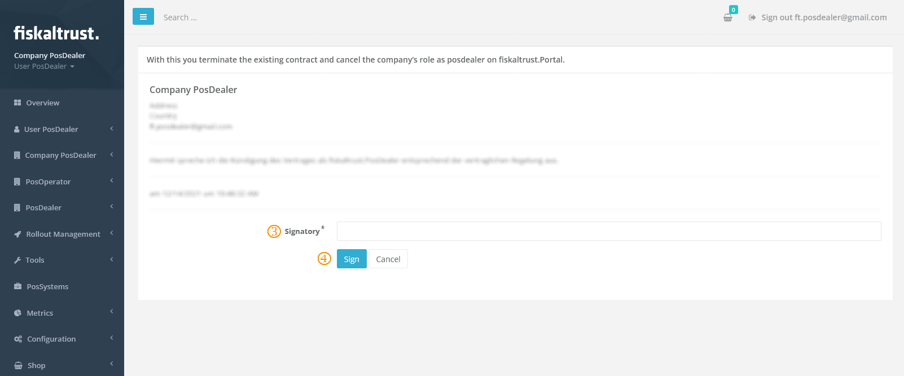

:::info summary

After reading this, you can choose the right roles and explain their effects.

:::

## Introduction

*fiskaltrust* distinguishes between four principal **company roles** in the context of the portal and its role management.

Each role has a specific audience and comes with a distinct set of features and permissions.

|                  Type                   | Description                                                  |
| :-------------------------------------: | ------------------------------------------------------------ |
|             | **PosOperator** This role is for **end-users of POS systems** who manage their POS receipts in the context of the services of *fiskaltrust*. They purchased the POS platform from their *PosDealer* and operate the POS system.  *Accounts with this role use the portal primarily to access their fiscal data and perform maintenance steps not covered by their PosDealer.* |
|             | **PosDealer** This role is for **POS system distributors** who sell POS systems to *PosOperators* and support and maintain these setups.  *Accounts with this role use the portal primarily to act on behalf of their PosOperators. This includes invitation management, a credit limit, rollouts of CashBox setups and their maintenance.* |
|  | **PosDealer auto-invitation** (Germany-only) This is an *optional* add-on role for **German POS system distributors** who wish to automate the on-boarding of their customers/operators as much as possible.  *Accounts with this role will have an extended on-boarding user interface, allowing them to fully and legally activate an operator's account, as opposed to a regular invitation which the operator first has to accept.*  **Please note, this role is only available on the German market and may require particular attention to legal aspects on your side.** |
|             | **PosCreator** This role is for **POS system manufacturers** who develop the respective POS software. They are not primarily involved in rollouts or deployments but focus on the **technical integration** of the Middleware.  *Accounts with this role use the portal primarily to set up their POS system definitions within the portal, create test configurations, and invite associated PosDealers.* |
|             | **Consultant** This role is for **tax consultants** who advise *PosOperators* on related topics.  *Accounts with this role use the portal primarily to access fiscal data of the associated (and authorised) operator accounts.* |

 

:::caution

While you can select more than one role, please **only pick roles applicable to your business case** and no others, as each role entails different contractual requirements and obligations.

:::

 

## How to activate a role

The following steps will activate a new role for your account.

|             Step             | Description                                                  |
| :--------------------------: | ------------------------------------------------------------ |
|  | Open your **company profile page** from `[COMPANYNAME]` / `Overview` in the left-hand navigation menu |
|  | **Switch the slider** of the role you'd like to activate from  to   |

After enabling the switch, a new page will load where you need to sign the respective agreement

|             Step             | Description                                                  |
| :--------------------------: | ------------------------------------------------------------ |
|  | Read the **agreement**                                       |
|  | Enter your **legal name** in the signature field at the bottom of the page |
|  | Check the box that you read and accepted the **terms and conditions** |
|  | **Click** the `Sign` button                                  |

**Done**, the selected role should now be already active for your account. You'll also receive an additional E-mail confirming the activation of that role.  

## How to deactivate a role

The following steps will deactivate an existing role of your account.

|             Step             | Description                                                  |
| :--------------------------: | ------------------------------------------------------------ |
|  | Open your **company profile page** from `[COMPANYNAME]` / `Overview` in the left-hand navigation menu |
|  | **Switch the slider** of the role you'd like to deactivate from  to   |

After disabling the switch, a new page will load where you need to confirm the step

|             Step             | Description                                                  |
| :--------------------------: | ------------------------------------------------------------ |
|  | Enter your **legal name** in the signature box at the bottom of the page |
|  | **Click** the `Sign` button                                  |

**Done**, the selected role should now be inactive for your account. You'll also receive an additional E-mail confirming the deactivation of that role.