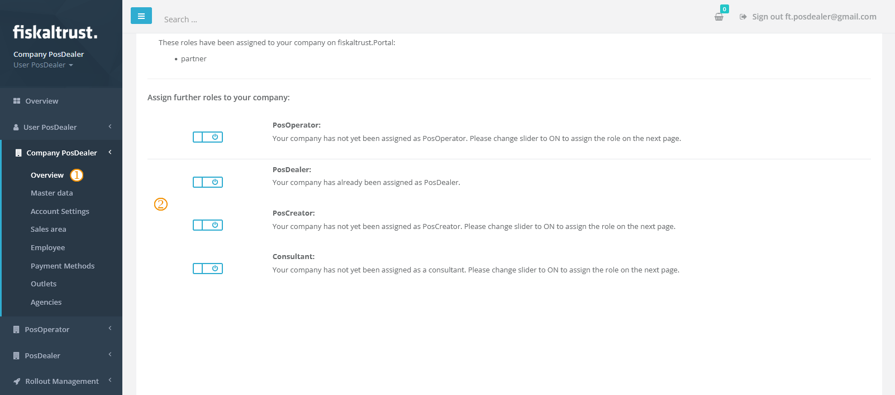
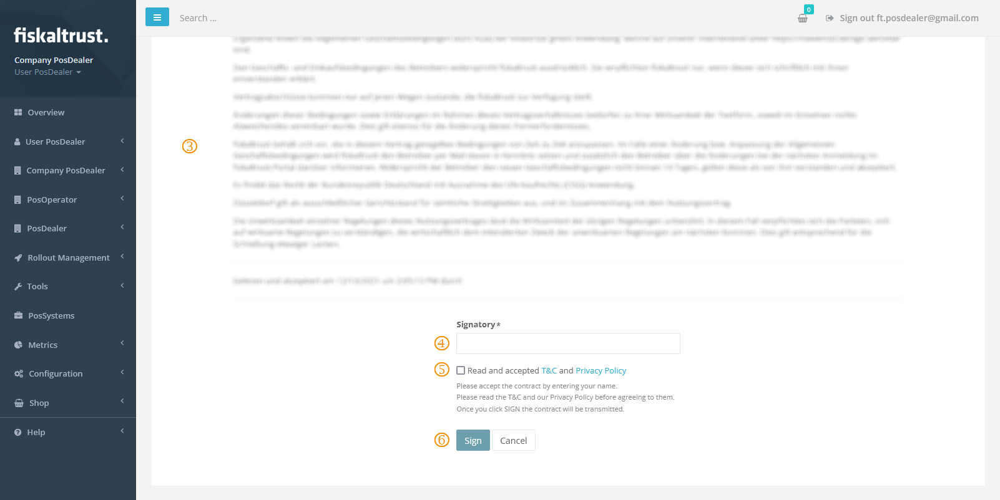
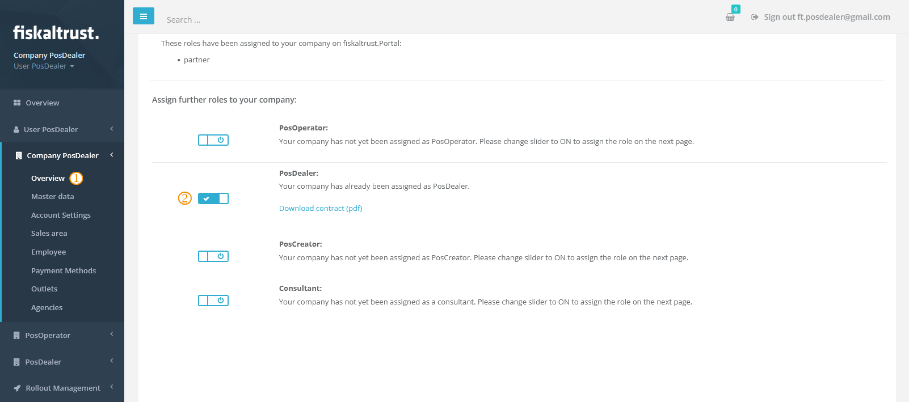

# Company Roles

:::info summary

After reading this, you can choose the right roles and explain their effects.

:::

*fiskaltrust* distinguishes between four principal **company roles** in the context of the portal and its role management.

Each role has a specific audience and comes with a distinct set of features and permissions.

1. **PosOperator** 
   This role is for **end-users of POS systems** who manage their POS receipts in the context of the services of *fiskaltrust*. They purchased the POS platform from their *PosDealer* and operate the POS system.

   *Accounts with this role use the portal primarily to access their fiscal data and perform maintenance steps not covered by their PosDealer.*

2. **PosDealer** 
   This role is for **POS system distributors** who sell POS systems to *PosOperators* and support and maintain these setups.

   *Accounts with this role use the portal primarily to act on behalf of their PosOperators. This includes invitation management, rollouts of CashBox setups and their maintenance.*

3. **PosCreator** 
   This role is for **POS system manufacturers** who develop the respective POS software. They are not primarily involved in rollouts or deployments but focus on the **technical integration** of the Middleware.

   *Accounts with this role use the portal primarily to set up their POS system definitions within the portal, create test configurations, and invite associated PosDealers.*

4. **Consultant** 
   This role is for **tax consultants** who advise *PosOperators* on related topics.

   *Accounts with this role use the portal primarily to access fiscal data of the associated (and authorised) operator accounts.*

 

:::caution

While you can select more than one role, please **only pick roles applicable to your business case** and no others, as each role entails different contractual requirements and obligations.

:::

 

## How to activate a role

The following steps will activate a new role for your account.

1. **Log in** to your portal account
2. Open your **company profile page** from `[COMPANY NAME]` / `Overview` in the left-hand navigation menu
3. **Switch the slider** of the role you'd like to activate from  to   *This will load a new page where you need to sign the respective agreement*

4. Read the **agreement**
5. Enter your **legal name** in the signature field at the bottom of the page
6. Check the box that you read and accepted the **terms and conditions**
7. **Click** the `Sign` button

**Done**, the selected role should now be already active for your account. You'll also receive an additional email confirming the activation of that role.  

## How to deactivate a role

The following steps will deactivate an existing role of your account.

1. **Log in** to your portal account
2. Open your **company profile page** from `[COMPANY NAME]` / `Overview` in the left-hand navigation menu
3. **Switch the slider** of the role you'd like to deactivate from  to   *This will load a new page where you need to confirm the step*

4. Enter your **legal name** in the signature box at the bottom of the page
5. **Click** the `Sign` button

**Done**, the selected role should now be inactive for your account. You'll also receive an additional email confirming the deactivation of that role.