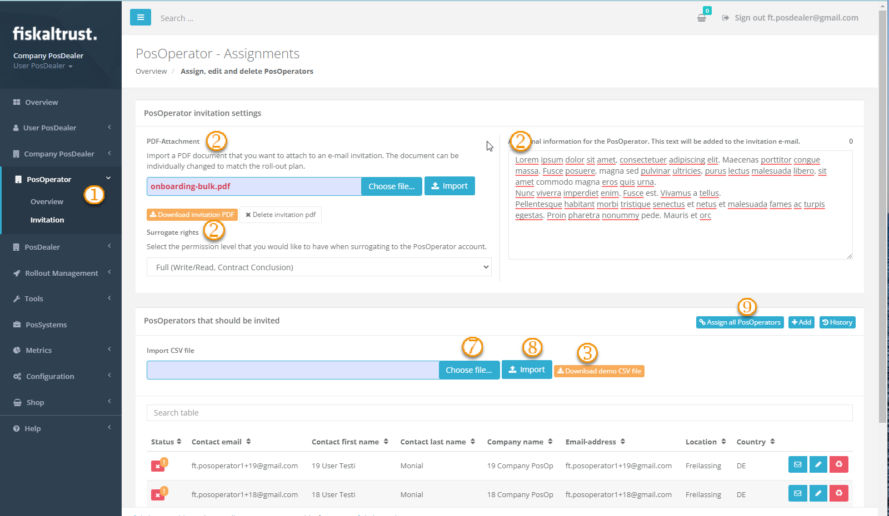
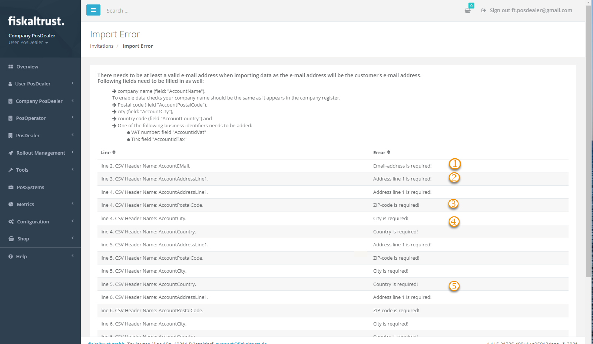
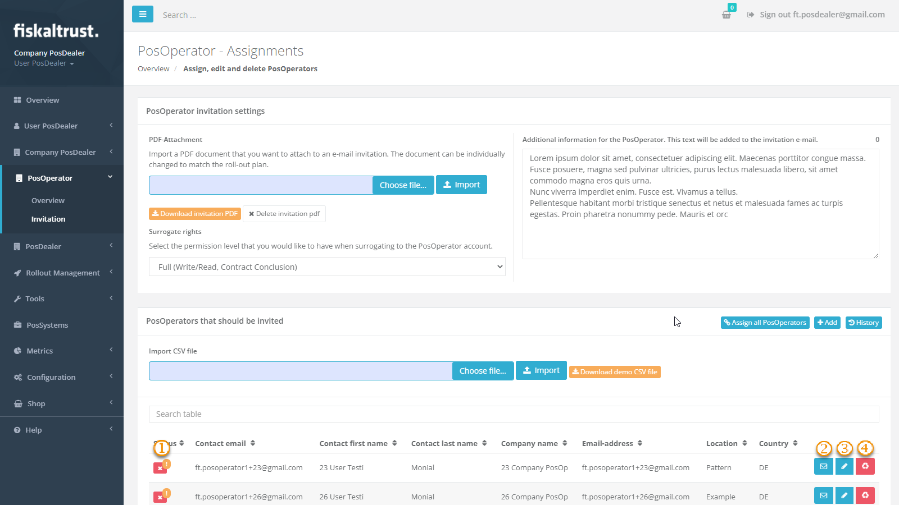

# Invitation process

:::info summary
After reading this, you can invite a single PosOperator and perform a bulk operation to invite several PosOperators.
:::

You as a PosDealer can do the invitation of a PosOperator only, this can not be made by a PosCreator or consultant.

However, the role of a PosDealer can also be activated by these companies and thus taken over in parallel to another role.

1. Choose PosDealer / Overview.  
2. A list of the already assigned PosOperators is shown.  
3. With PosDealer / Invitation you will find Options to add PosOperators.  

## Preparation of Invitations

There are two ways to add and assign PosOperators to your Account as a PosDealer:

1. For adding a single PosOperator, read this chapter and see afterwards [_Invitation of a single PosOperator_](#invitation-of-a-single-posoperator).
2. For Adding several PosOperators by importing a CSV file, read this chapter and change then to [_Invitation of PosOperators_](#invitation-of-posoperators).
3.  Checking or changing the settings for the invitations is **inevitable for both ways**. Therefore, regardless of the further way, prepare the settings first.  To do this, select PosOperators / Invitations.  
  
4. Control or change the setting for the invitation:
    1. PDF-Attachment:  
    Avoid confusing your PosOperators when they receive an e-mail invitation from an unknown source like robot@- or robot@fiskaltrust.abc. Explain in an accompanying letter that you as PosDealer are extending your offers and invite him to register with the fiskaltrust.portal via the confirmation link. With [Choose file...] and [Import] your document will be added as an attachment to the invitation.
    2. add information text:  
    The automated e-mail invitation to your PosOperator from an source like robot@- or robot@fiskaltrust.abc can be supplemented with your text. Use this text block up to a maximum of 400 characters to inform your PosOperators personally. Explain that you as PosDealer extend your offers and invite him to register with the fiskaltrust.Portal via the confirmation link.
    3. Surrogate rights:  
    Set the rights you should have as PosDealer after switching to the PosOperator's account to [FULL]. Otherwise, you would have access to the PsOperator's account, but you would not be able to conclude contracts on his behalf. But these are necessary for the cooperation with third parties.

## Invitation of a single PosOperator

### Overview individual invitation

  

### Explanation individual invitation

The single invitation is particularly interesting for the on-site support that you give as a the PosDealer, if a PosOperator wants to use the fiskaltrust.Services immediately - in connection with the commissioning of a POS-System. Further, you may want to learn about and test the portal and its processes in the sandbox. The Invitation of a single PosOperator is also useful here.

### Work steps individual invitation

1. Choose PosOperator / Invitation
2. Check the settings previously described [_here_](#preparation-of-invitations).
3. Choose [Add]
4. The following fields are mandatory fields. They must be filled in to guarantee that the PosOperator can be found correctly in the fiskaltrust.Portal via his e-mail address and can be assigned:
    * Company data - Company name
    * E-mail address
    * Address line 1
    * Postal code
    * City
    * Country
    * User data - First name
    * Last name
    * Contact E-mail address
5. The commercial identification is no mandatory field for the invitation.  
But for the correct management of the cash register systems, these data and their validation are essential.
6. Save your values with [Save]
7. Choose [Assign all PosOperators]
8. If the invitation does not reach the PosOperator, please read the chapter [_Managing the invitations_](#managing-the-invitations)

## Invitation of PosOperators in a bulk process

### Overview bulk process

  

### Explanation bulk process

Inviting PosOperators to a PosDealer account with an import file is especially interesting if you want to invite a larger number of business partners. Since the invitations are created and sent automatically via the fiskaltrust.portal, the information of your business partners is relevant. Therefore, please note the section on preparation to avoid irritation, loss of time or effort due to invitations mistakenly treated as SPAM. The necessary structure of the CSV file is described using an example. This example can be obtained in the fiskaltrust.Portal. 

### Work steps bulk process

  

1. Choose PosOperator / Invitation
2. Check the configurations of the invitations as previously described [_here_](#preparation-of-invitations).
3. Download the demo CSV file.
4. Open the the demo CSV file.
5. See the [_explanation below_](fields-of-the-csv-file), add the requested data of the PosOperators and save the date as a CSV file.
6. Change  again to the fiskaltrust.Portal and choose PosOperator / Invitation / PosOperators that should be invited.
7. Use [Choose file...] to set your CSV file.
8. With [Import] the data are uploaded and analyzed to avoid duplicate or incomplete records. You can control or add data to each record. 
9. Choose [Assign all PosOperators] to send the invitation-E-mail to each business partner in your CSV file.

### Fields of the CSV file

| Fields | Description                                                                                                                         | Mandatory |
|------------------------|-------------------------------------------------------------------------------------------------------------------------------------|:---------:|
| AccountName            | Company name, this should be written exactly as it is in the commercial register                                                    | yes       |
| AccountEmail           | General e-mail address of the company **IMPORTANT!** All information and all invoices will be sent to this e-mail address!      | no        |
| AccountAddressLine1    | Address, first line of the company                                                                                                  | no        |
| AccountAddressLine2    | Address, second line of the company                                                                                                 | no        |
| AccountPostalCode      | Postcode of the company                                                                                                             | no (A)        |
| AccountCity            | Name of city of the company's address                                                                                               | no        |
| AccountCountry         | Zip-Code of the city                                                                                                                | no        |
| AccountWeb             | URL of the company's website                                                                                                        | no        |
| AccountPhone           | Company phone number                                                                                                                | no        |
| commercial identification 1           | country-specific **IMPORTANT!** This is one of the identification criterias for legalisation of the service.        | no (B)        |
| commercial identification 2          | country-specific **IMPORTANT!** This is one of the identification criterias for legalisation of the service.        | no        |
| ContactFirstName       | First name of the primary contact                                                                                                   | yes       |
| ContactLastName        | Last name of primary contact                                                                                                        | yes       |
| ContactEmail           | Email address of the primary contact **IMPORTANT!** This e-mail address will be the user's login to the newly created company. | yes       |
| ContactTitle           | (Academic) Title of primary contact (before name)                                                                                   | no        |
| ContactMobilePhone     | Mobile phone number of the primary contact                                                                                          | no        |

A = Not all of the fields _commercial identification_ are mandatory. The naming might be country-specific, but one of the three fields should be completed.
B = There may be country-specific differences in which fields are mandatory to fill in. For example, the postal code is only mandatory in Austria. 

#### Handling error messages

* If not all of the mandatory fields of the csv file are completed error messages with the wrong or missing data are shown.
* please note the error messages and add the necessary data in the respective lines of the CSV file 

## Managing the invitations

### Explanation 

If the preparations are done, the invitation process should work automatized. However, if problems arise, you can fix the most of them on yourself. Have a look at the protocol of invitations, if a PosOperator claims, that there was no e-mail invitation. There a several ways to help.

### Assigning, editing and deleting a PosOperator

* Check the Status  of the invitation. A red symbol shows, that the E-mail invitation has not yet been sent. 

* Use  to send / resend this single e-mail invitation or [Assign all PosOperators] to send all.
* Choose  to edit the data of the PosOperator, if they are not correct and can not be assigned to the PosDealers account.
* Use  to delete the data of a not yet assigned PosOperator.

### Assigning PosOperators in a bulk process

* By clicking on  [Assign all PosOperator users] the e-mail invitation can be sent to **all**  PosOperators who have not yet been invited.
*  is used for a manual invitation, see chapter [_Invitation of a single PosOperator_](#invitation-of-a-single-posoperator).
* Choose  for for control or also repair of e-mail invitations.

### Protocol of invitations

1. The start date of the log overview can be restricted using this field. 
2. The last date of the log overview can be restricted using this field. Start the search with [Invoke protocol]. If the two fields are empty the whole protocol without any filter is shown.  
Entering a text filters at [Search table] reduces the overview. By deleting all entered data in the search field the whole overview data is shown.
4. Check the details of the data of a PosOperator. 
5. Resend the e-mail invitation for this data record.
1. Delete the data record. please note that once an email address has been assigned, it cannot be completely deleted for fiscal reasons. Therefore, it cannot be assigned to any other account in fiskaltrust.Portal. 
6. Shows a window with the direct link for the invitation. This can be copied in the clipboard and send by direct message. 

Return to the Invitation module with [Overview of PosOperator].
