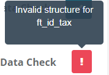

# Master Data

:::info summary
After reading this, you can keep your and the PosOperators Master data up-to-date and explain, why that is important.
:::

## Introduction

The Master data of a company in the fiskaltrust.Portal are important for various reasons:  
On the one hand, parts of this data, such as commercial identifications, are used for authentication with the tax authorities or third party services.  
On the other hand, this data is used for automated invoice generation between PosDealer and PosOperators.  
It is therefore essential to check the completeness of Master data in the fiskaltrust.Portal. Country-specific check mechanisms are also available for checking the data entered.
Depending on the legal situation and the technical equipment of the tax authority, it is checked whether an entered value meets the formal requirements.  
Under country-specific circumstances, when a PosOperator is first registered, the other master data can be retrieved from the relevant authority and checked imported by entering a tax number.

After logging on to the fiskaltrust.Portal, you as a PosDealer should check the completeness and also use the available checking mechanisms.

Basically, the information about the user at `[USERNAME]` / `Data` is only important for using the fiskaltrust.Portal. For data protection reasons, fictitious names or function designations can also be used there instead of real data. Only the E-Mail address must be a real, working one, because the login to the fiskaltrust.Portal is done via this address. But also here names can be avoided and functional names can be used (like fiskalizing@PosOperator.TLD).

For PosOperators, it is equally essential to check the Master data for completeness and correctness. This must be done in the respective account. 

To illustrate the processes of checking and validation of Master data, we show here in detail the procedure for checking your own Master data. Having this and the import of PosOperators done, you use the surrogating to change into the account of your PosOperators. Please refer to the section [Surrogating](surrogating.md) to check the Master data for completeness and correctness.

### Work steps to check Master data

import Tabs from '@theme/Tabs';
import TabItem from '@theme/TabItem';
import PreviewAT from '../../_markets/at/getting-started/operator-onboarding/master-data/_edit-master.mdx';
import PreviewFR from '../../_markets/fr/getting-started/operator-onboarding/master-data/_edit-master.mdx';
import PreviewDE from '../../_markets/de/getting-started/operator-onboarding/master-data/_edit-master.mdx';

<Tabs groupId="market">

  <TabItem value="AT" label="Austria">
    <PreviewAT />
  </TabItem>

  <TabItem value="FR" label="France">
    <PreviewFR />
  </TabItem>

  <TabItem value="DE" label="Germany">
    <PreviewDE />
  </TabItem>

</Tabs>

| Steps | Description                                                                                                                |
|:---------------------------:|--------------------------------------------------------------------------------------------------------------------------------|
| |Enter the fiskaltrust.Portal and choose `[COMPANY NAME]` / `Master data`  |
| |Check the fields marked with * for correct and complete data.  |
| |Check the values for commercial identification first using the explanations arranged below the data fields. Observe the notes on notation, such as the number of digits and the omission of spaces. Also note the information on whether one or more dates are required, as this varies from country to country.  |
| |Then check the entered values with the `Data Check` on the right of the data fields.  |

| data check results | options                                                                                                                |
|:----------------------:|-------------------------------------------------------------------------------------------------------------------------------------|
| |This symbol stands for an unchecked value in the data field.  |
| |This symbol stands for invalid values. Hover with your mouse over the symbol and note the description. Change the values accordingly and repeat the data check. |
| |This symbol shows a positive validation of the value in the data field. Please note, that this is no protection of using duplicates|

### Check or add outlets

import OutletAT from '../../_markets/at/getting-started/operator-onboarding/master-data/_checking-outlets.mdx';
import OutletFR from '../../_markets/fr/getting-started/operator-onboarding/master-data/_checking-outlets.mdx';
import OutletDE from '../../_markets/de/getting-started/operator-onboarding/master-data/_checking-outlets.mdx';

<Tabs groupId="market">

  <TabItem value="AT" label="Austria">
    <OutletAT />
  </TabItem>

  <TabItem value="FR" label="France">
    <OutletFR />
  </TabItem>

  <TabItem value="DE" label="Germany">
    <OutletDE />
  </TabItem>

</Tabs>

| Steps | Description                                                                                                                |
|:---------------------------:|--------------------------------------------------------------------------------------------------------------------------------|
| |Choose `[COMPANY NAME]` / `Outlets` and control the existing values. |
| |If several outlets are missing, use `Download demo CSV file`.  |
| |Open the CSV file, add the desired values and save it. Change back to the fiskaltrust.Portal / `[COMPANY NAME]`/ `Outlet` and `Choose file`. |
| |With `Import` the data are checked in `Bulk import of Outlets`, where you choose `Proceed with valid outlets`.  |
| |If only a single outlet is missing, choose `+Add new Outlet`.  |
| |Please note, that `Edit Primary Outlet` changes the address values that you have previously checked under `[COMPANY NAME]` / `Master data`.  |