# A TSE per cash register
This guide walks you through the most basic setup with one dedicated cashbox (one *Queue* and one *SCU/TSE*) for each cash register.

## 0 - Prerequisites
As dealer please make sure you have used the **surrogate function** first to **enter your client's account and make subsequent changes in that context**.

For this, click `PosOperator` - `Overview` in the left-hand menu, search for your client, and click on your client's name.

*Should it not be possible to click the name, please check the status icon and make sure the client is active (otherwise they might not have completed their account setup yet).*

Once you entered your client's account you will notice a red `Switch to your account` button in the top right, which is how you return to your own account and which indicates that you are now successfully operating from within your client's account.

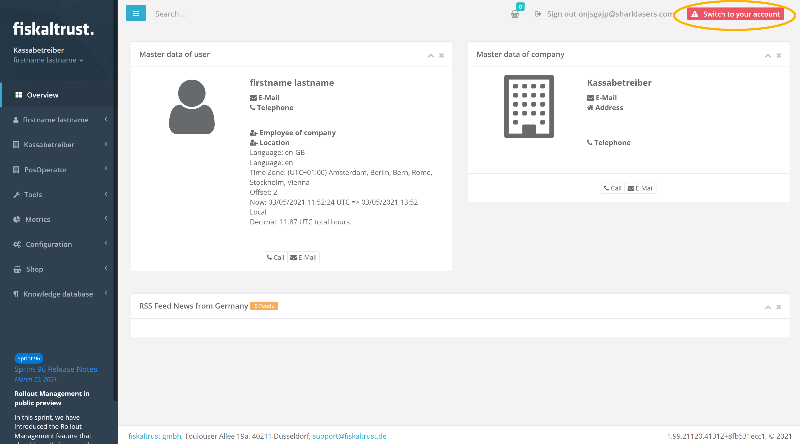

## 1 - Creating the SCU
### Step 1 - Navigating
Choose `Configuration` - `Signatur creation unit` from the left-hand menu.

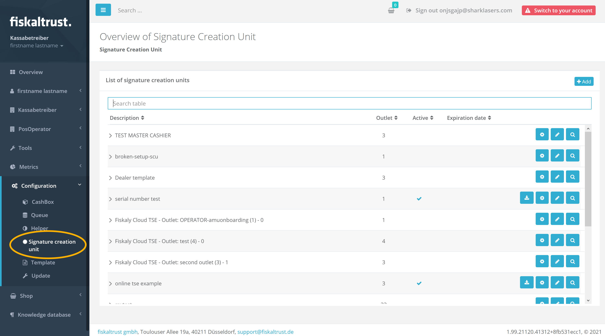

### Step 2 - Selecting the add option

Click the `Add` button.

### Step 3 - Entering the details
Enter a descriptive name for your new SCU in the description field, choose the right package and version applicable to this particular TSE, and select the outlet in which this SCU should be active. When selecting a package, the portal will automatically pick the most recent version as default.

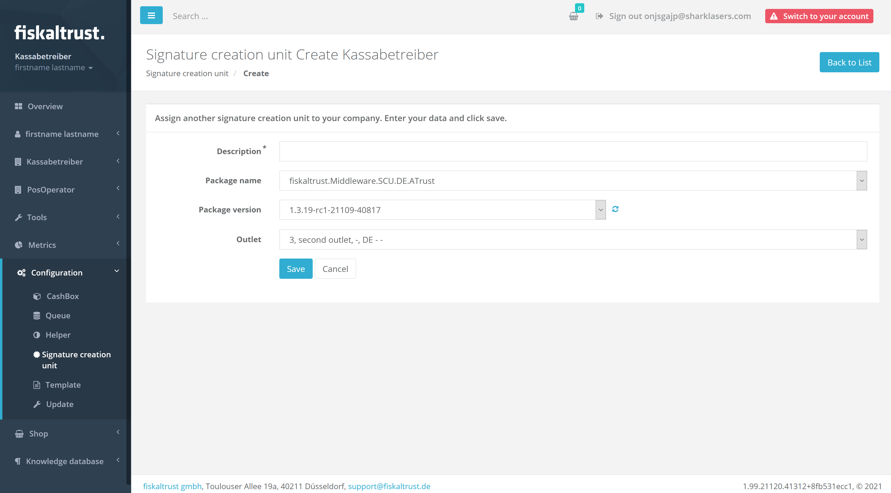

Once you have entered all information, click `Save` and you'll be redirected to a screen where you configure additional technical details. The majority of these settings is TSE specific (*in the following example we chose a Fiskaly cloud TSE*) and you will need to provide the values required by that TSE (e.g. the right drive letter or the right API key).

Another important part here is the URL under which the SCU should be accessible to the queue. This includes three elements

1. the communication protocol. You can choose between gRPC, REST, SOAP, and net.pipe
2. the hostname (for this setup it should be `localhost`)
3. the URL path specific to this SCU

Click one of the available protocol types to automatically generate an appropriate URL. You can leave the default values for the URL, unless your setup requires specific settings.

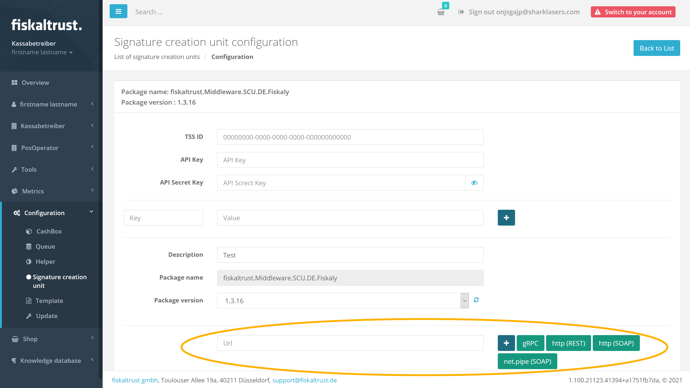

Once you have finished the configuration scroll to the bottom, click `Save and close` and the new SCU should be listed on the subsequent screen of all your client's SCUs.

## 2 - Creating the Queue
### Step 1 - Navigating
Choose `Configuration` - `Queue` from the left-hand menu.

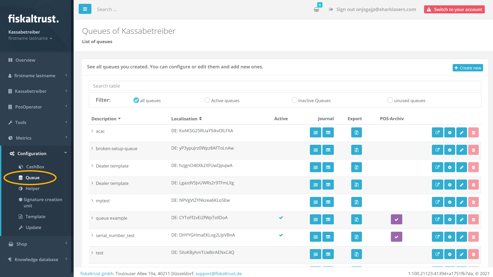

### Step 2 - Selecting the create option
Click the `Create new` button.

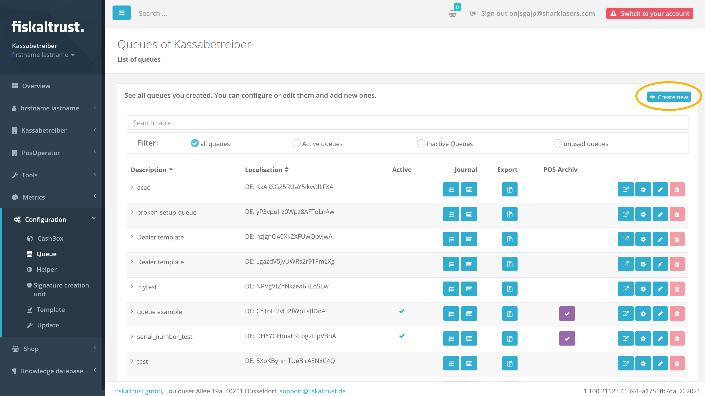

### Step 3 - Entering the details

Enter a descriptive name for your new queue in the description field, choose the right package for the desired backend storage and the applicable version, enter the desired timeout (default 15,000 milliseconds), enter the serial or identification number of your cash register (*or tick `Generate Identifcation` to let the portal generate a unique number*), and select the outlet in which this queue should be active.

Once you have entered all information, scroll down, click `Save` and you'll be redirected to a screen where you configure additional technical details. The most important part here is the URL under which the queue should accept IPOS requests from your cash register. This URL includes three elements

1. the communication protocol. You can choose between gRPC, REST, SOAP, and net.pipe
2. the hostname (`localhost` if the queue runs on the same machine as your cash register)
3. the URL path specific to this queue and where the cash register will send requests to

Click one of the available protocol types to automatically generate an appropriate URL. You can leave the default values for the URL, unless your setup requires specific settings.

Once you have finished the configuration click `Save and close` and the new queue should be listed on the subsequent screen of all your client's queues.

## 3 - Creating the Cashbox
The cashbox is the central entry point and contains the whole configuration of your middleware instance and will combine and connect the queue with the SCU.

### Step 1 - Navigating

Choose `Configuration` - `CashBox` from the left-hand menu.

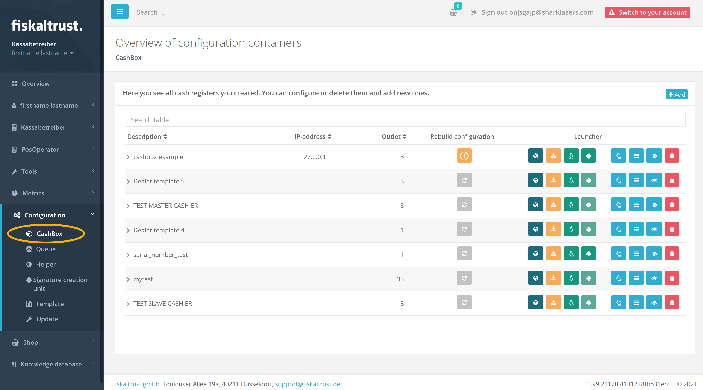

### Step 2 - Selecting the add option

Click the `Add` button.

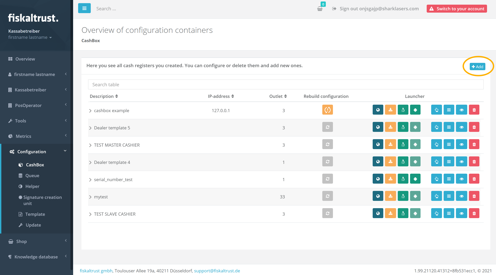

### Step 3 - Entering the details

Enter a descriptive name for your new cashbox in the description field and select the outlet in which this queue should be active. Optionally you can also specify a hostname or IP address which will be used as default for any cashbox-external SCUs.

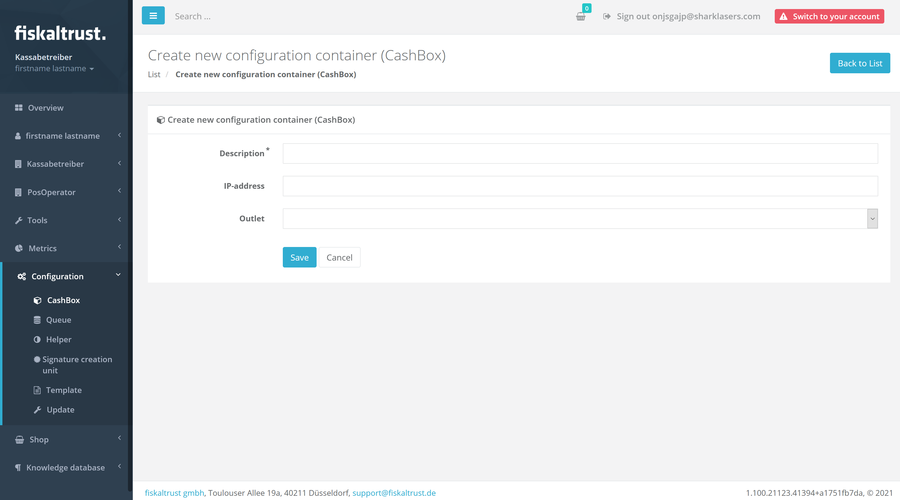

Once you have entered all information, click `Save` and the new cashbox should be listed on the subsequent screen of all your client's cashbox.

### Step 4 - Connecting the components

* Back to the list of your cashboxes, click the `Edit by list` button.

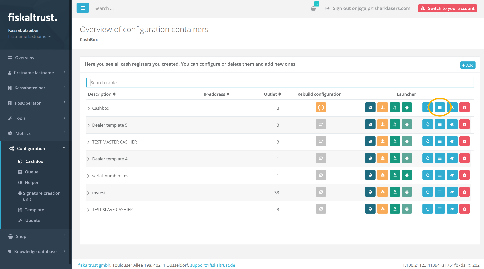

* On the subsequent screen you need to select the previously added queue for this cashbox by ticking the correct row.

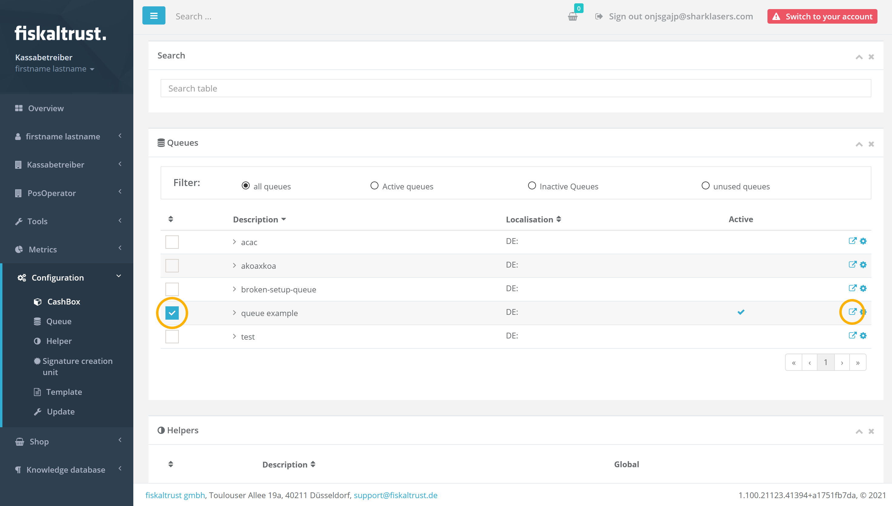

Additionally you need to **connect the queue to the SCU**, for which you click the pop-out icon on the right side. This will open the following screen where you need to select the previously added SCU and click `Save and close`.

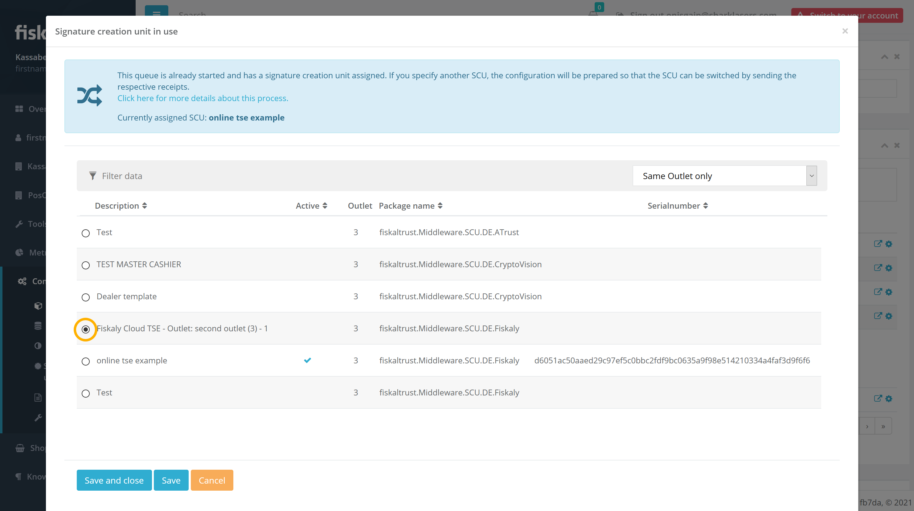

* Now we have configured the queue for the cashbox and connected it to the SCU but we still need to add the SCU to the cashbox as well, which we do by ticking the correct row

## 4 - Building the cashbox

This is an **important step** which you always have to perform after you created a cashbox, respectively, even after **making any sort of change to its configuration**.

To (re)build a cashbox, navigate to your list of cashboxes and click the cashbox's `Rebuild configuration` button whenever it is highlighted in orange.

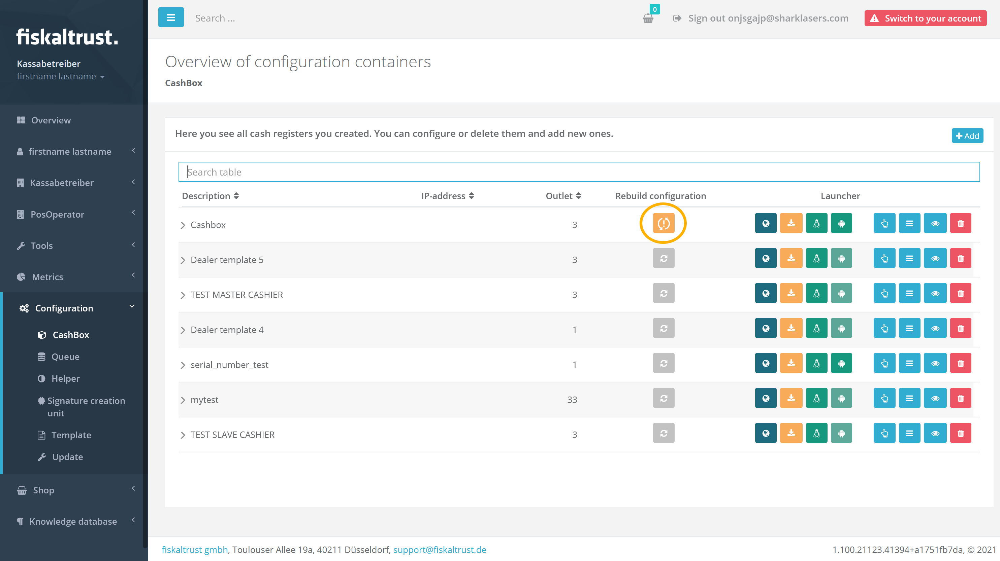

The whole rebuild process is fairly quick and will finish in a few seconds. The moment the rebuild button is greyed out, you'll have an up-to-date configuration.

## Summary

At this point you'll have

* one **SCU**, associated with your TSE
* one **queue**, connected to the SCU
* and one **cashbox**, containing both the SCU and the queue

You can now download the launcher of your choice and deploy the launcher with its cashbox configuration on your cash registers.