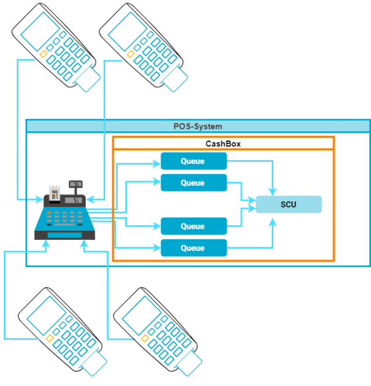

:::info summary

After reading this, you can design the setup of the Middleware components and decide how to integrate them into your environment.

:::

## Introduction

The scenarios in this general part will not cover all the aspects, that can be covered with fiskaltrust.Middleware and our products. 
Please check the country specific notes for further details. Due to technical or legal reasons not all scenarios are available in every country.

### Explanation of terms and graphics

Please not our [terminology](../../faq/terms.md) for the terms used in our application and this documentation.

The scenarios are described by pros and cons. The term _POS-System fails_ means, that the Queue will switch into failed mode, but is still operational until the connection is restored with a zero receipt. 

| Image | Description  | Image | Description  |
|:----------------------:|:----------------------|:----------------------:|:----------------------|
| | **Main POS-System**  | |Subsidiary POS-System  |
|  |Terminal, handheld  |  |Server  |

## Scenarios

### One SCU for each POS-System
A single SCU for each POS-System is the simplest - and often the most reliable - architectural approach and works best for independent, standalone POS-systems.

| Facts | Description  |
|:----------------------:|:----------------------|
|pro |High reliability for the PosOperator with one single POS-System - very high reliability, if several POS-Systems in operation  |
|pro |High performance, when several POS-Systems are in operation, best possible performance  |
|con |Consistent costs for each POS-System without regard to varying needs  |
|Restrictions |--- |

### One SCU at server for multiple POS-Systems
Hosting a single SCU in a separate CashBox that is accessed by multiple Queues/POS-Systems can be a more efficient solution for interconnected systems, e.g. in stores with multiple POS-Systems and an on-site backoffice.

| Facts | Description  |
|:----------------------:|:----------------------|
|pro |Lower costs, if a hardware signature element is needed|
|pro |High performance, as a large number of requests can be distributed to several multiple SCUs |
|con |High effort during installation, coordination with providers|
|con |Attention to the installation during maintenance and care|
|con |Server or signing devices can be the performance bottleneck|
|Restrictions | Due to technical or legal reasons this scenario is not available in every country, please check the country specific notes ! |

### One SCU in main POS-System, used by other POS-Systems
Hosting a single SCU for multiple Queues in the CashBox of the _main_ POS-System can be a more efficient solution for interconnected systems, e.g. in stores with multiple POS-Systems and no on-site backoffice.

| Facts | Description  |
|:----------------------:|:----------------------|
|pro |Lower costs, if a hardware signature element is needed|
|pro |Lower costs, because no server is needed|
|con |Low reliability for the PosOperator, if SCU is out of operation, all POS-Systems fail|
|con |The SCU in the main POS-System can be the performance bottleneck|
|Restrictions |Due to technical or legal reasons this scenario is not available in every country, please check the country specific notes!|

### Multiple POS-Systems share one external signature service
In scenarios where the external signing provider supports multi-place usage, this architecture helps reducing local network complexity by re-using the same SCU in multiple CashBoxes.

| Facts | Description  |
|:----------------------:|:----------------------|
|pro |High performance, as a large number of requests can be distributed to several multiple SCUs |
|pro |Lower costs, if a signature element is shared|
|pro |High reliability for the PosOperator, even if internet connection fails|
|Restrictions |Restrictions depending on fair-use-rules or technical limitations are possible. Due to technical or legal reasons not all scenarios are available in every country. |

### Main POS-System for multiple Terminals
This scenario is recommend for interconnected POS-Systems where terminals that have no standalone-functionality are connected to a central system.

| Facts | Description  |
|:----------------------:|:----------------------|
|pro |Flexibility with changing workloads by adjusting the number of terminals |
|pro |High spatial flexibility of the employees|
|pro |Lower costs, because no server is needed|
|con |Low reliability for the PosOperator, if SCU is out of operation, all Terminals and the POS-System fail|
|con |Main POS-System can be the performance bottleneck|
|Restrictions | Due to technical or legal reasons this scenario is not available in every country, please check the country specific notes! |

:::tip

Experiences of our partners showed that in exceptional cases terminals become defective. If at this moment a receipt of the defective device is being processed, this can lead to the blocking of a shared queue. This would cause the entire system to fail. You can achieve greater reliability by creating a separate queue for each terminal, as shown in the following diagram. 

:::

### Data center as operational environment
This scenarios works best in centralized system architectures. Many POS systems or terminals can be connected to the hosted version of the fiskaltrust.Middleware, which is operated either in fiskaltrust's or the users datacenter. In countries where remote signing is allowed (Austria and France), this is the generally recommended solution, as it does not require any locally installed Middleware instances.

| Facts | Description  |
|:----------------------:|:----------------------|
|pro |Flexibility with changing workloads by adjusting the number of terminals |
|pro |High spatial flexibility of the employees|
|pro |The terminals remain safe in the operational environment |
|pro |Lower costs, because no POS-System and no server is needed|
|con |Depending on country-specific conditions, reliability for the PosOperator may be limited if the online POS system is not available. |
|con |Internet connection or online POS-System can be a performance bottleneck|
|Restrictions |Coordination and cooperation of several providers, systems may result in a high effort of installation |
